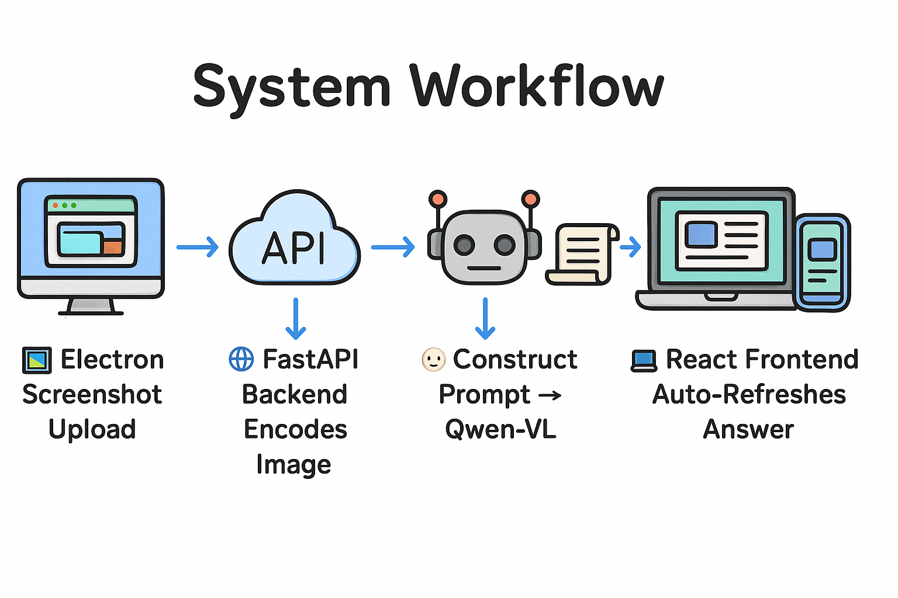
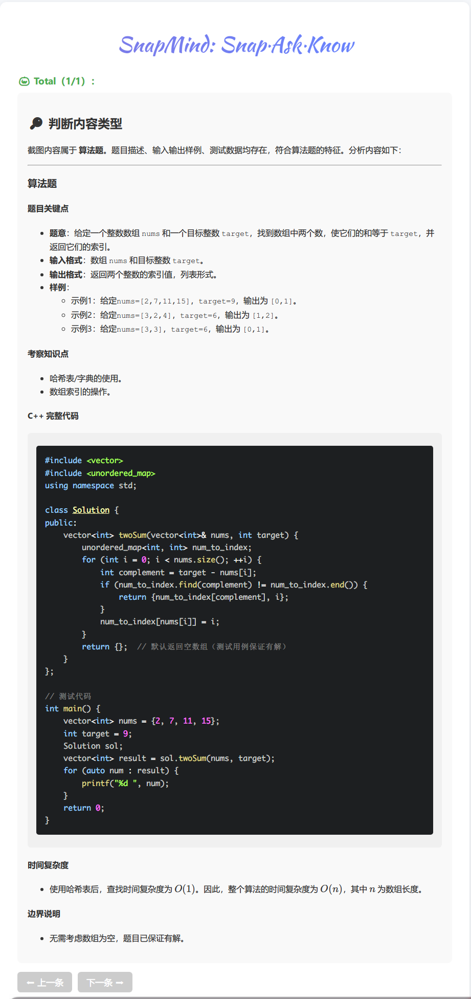
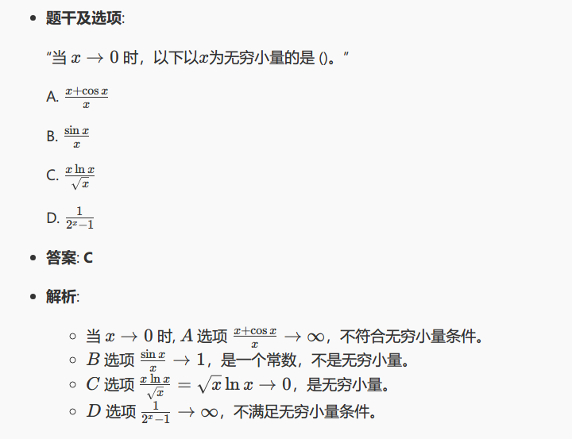
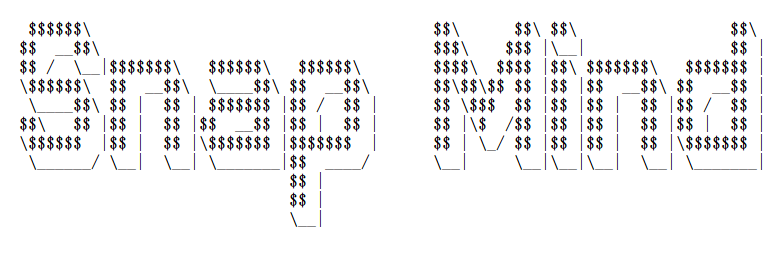

# 📸 SnapMind

> SnapMind: Snap. Ask. Know.
> 静默截图 + 远程透传 + AI 智能问答



## 💡 功能简介

- ✨ 静默截图上传，自动获取 AI 解答
- 🧠 支持算法题、选择题、填空题等，代码+公式高亮
- 🌍 多平台支持（网页 / Electron / 移动端访问）
- 🧾 自动轮询、历史记录切换，快捷键操作、自动复制代码
- 🔧 模块清晰，前后端独立，方便二次开发与扩展
- 📚 支持多种 AI 模型，可自定义提示词

## 🚀 快速开始

📦 **项目结构**

```
SnapMind/
├── backend-api/      # FastAPI 后端服务
├── client-electron/  # Electron 客户端
├── web-frontend/     # React 前端界面
├── deploy/           # 环境部署及后续优化
├── shared/           # 后续优化
├── Start_SnapMind.sh # 启动脚本
├── requirements.txt  # Python 依赖
└── README.md
```

🖥️ **环境部署**

| 步骤          | 命令                                                              |
| ------------- | ----------------------------------------------------------------- |
| 创建虚拟环境  | `conda create -n YOU_ENV_NAME python=3.11 `                       |
| 后端安装依赖  | `conda activate YOU_ENV_NAME &&  pip install -r requirements.txt` |
| 后端服务启动  | `uvicorn main:app --host 0.0.0.0 --port 8000`                     |
| 前端开发部署  | `cd web-frontend && npm install && npm run dev`                   |
| Electron 开发 | `cd client-electron && npm install && npm run start`              |

🎃 **启动及使用：**

- 可依次执行上述命令或者直接运行 `Start_SnapMind.sh` 脚本；
- 由于校园网隔离，所以若要移动端访问最好开热点或内网穿透；
- 后端服务运行在 `http://localhost:8000`，前端访问地址为 `http://localhost:5173`,移动端可在`http://<your-ip>:5173` 访问；
- 默认使用硅基流动的`Qwen2.5-VL-7B-Instruct`模型，若要使用其他模型或提示词请在前端配置文件中修改，`API_KEY` 需要替换为自己的 API 密钥。
- 使用`Ctrl + Shift + S` 快捷键进行截图，稍等片刻答案透传至前端显示，可切换历史记录。
- 更多功能待完善

## 📸 功能展示

- 算法解题与思路解析
  
- 数学公式题型
  

## 开发与扩展建议

- 🧩 可对后端增加本地模型 / 多模型切换
- 📤 支持拖拽上传 / 手机端拍照上传
- 🧪 支持题目类型自定义分类器（可接入本地 ML 模型）

✨ _SnapMind_ 由 _Hyoung_ 开发构建，欢迎贡献与反馈！

